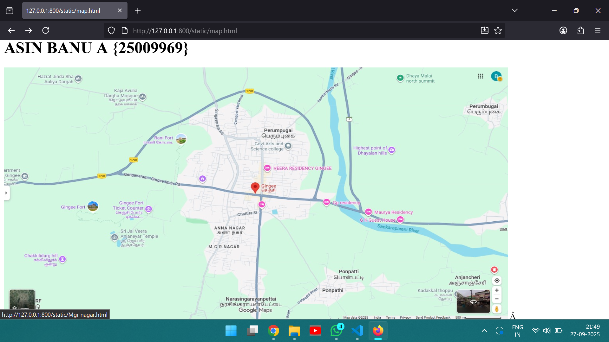
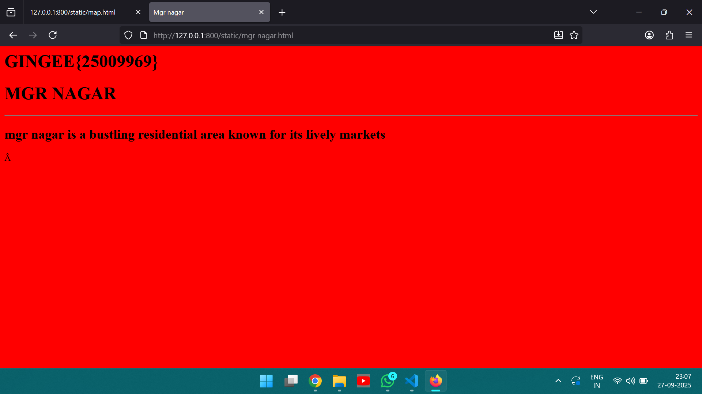
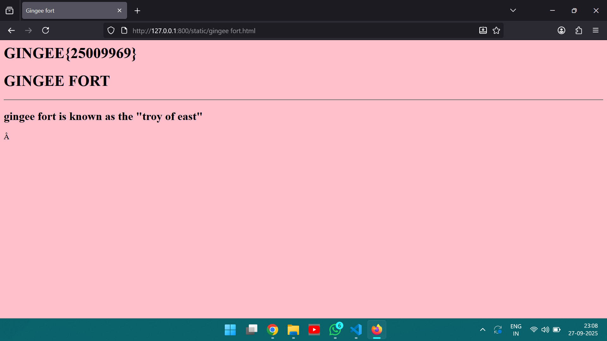
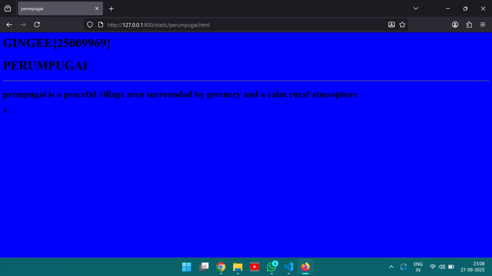
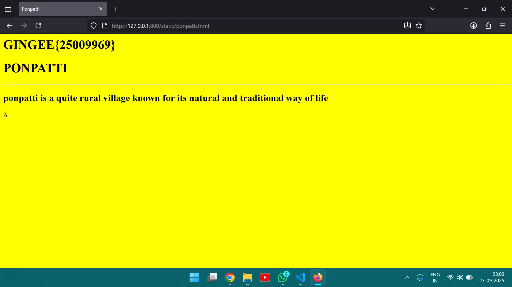
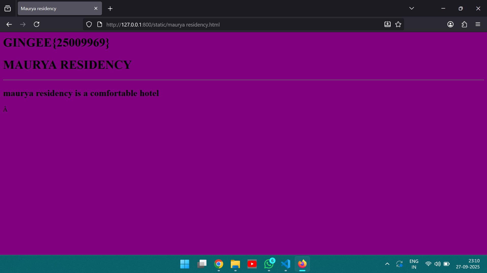

# Ex04 Places Around Me
## Date: 27/09/2025

## AIM
To develop a website to display details about the places around my house.

## DESIGN STEPS

### STEP 1
Create a Django admin interface.

### STEP 2
Download your city map from Google.

### STEP 3
Using ```<map>``` tag name the map.

### STEP 4
Create clickable regions in the image using ```<area>``` tag.

### STEP 5
Write HTML programs for all the regions identified.

### STEP 6
Execute the programs and publish them.

## CODE
```
map.html
<html>
    <head>
        <body align="center">
            <h1>GINGEE</h1>
            <h1>ASIN BANU A {25009969}</h1>
            
            <map name="image-map">
                <area target="" alt="Mgr nagar" title="Mgr nagar" href="Mgr nagar.html" coords="621,504,832,585" shape="circle">
                <area target="" alt="Gingee fort" title="Gingee fort" href="Gingee fort.html" coords="866,692,98" shape="rect">
                <area target="" alt="Perumpugai" title="Perumpugai" href="Perumpugai.html" coords="302,693,301,776,367,809,444,809,480,764,520,726,498,668,368,659" shape="poly">
                <area target="" alt="Ponpatti" title="Ponpatti" href="Ponpatti.html" coords="895,337,1079,408" shape="circle">
                <area target="" alt="Maurya residency" title="Maurya residency" href="Maurya residency.html" coords="124,502,77" shape="rect">
            </map>
        </body>
    </head>
</html>

mgr nagar.html
<html>
    <head>
        <title>
            Mgr nagar
        </title>
    </head>
    <body bgcolor="red" align="center">
        <h1>GINGEE{25009969}</h1>
        <h1>MGR NAGAR</h1>
        <hr>

        <h2>mgr nagar is a bustling residential area known for its lively markets</h2>
    </body>
</html>

gingee fort.html
<html>
    <head>
        <title>
            Gingee fort
        </title>
    </head>
    <body bgcolor="pink" align="center">
        <h1>GINGEE{25009969}</h1>
        <h1>GINGEE FORT</h1>
        <hr>

        <h2>gingee fort is known as the "troy of east"</h2>
    </body>
</html>

perumpugai.html
<html>
    <head>
        <title>
            perumpugai
        </title>
    </head>
    <body bgcolor="blue" align="center">
        <h1>GINGEE{25009969}</h1>
        <h1>PERUMPUGAI</h1>
        <hr>

        <h2>perumpugai is a peaceful village area surrounded by greenery and a calm rural atmosphere</h2>
    </body>
</html>

ponpatti.html
<html>
    <head>
        <title>
            Ponpatti
        </title>
    </head>
    <body bgcolor="yellow" align="center">
        <h1>GINGEE{25009969}</h1>
        <h1>PONPATTI</h1>
        <hr>

        <h2>ponpatti is a quite rural village known for its natural and traditional way of life</h2>
    </body>
</html>

maurya residency.html
<html>
    <head>
        <title>
            Maurya residency
        </title>
    </head>
    <body bgcolor="purple" align="center">
        <h1>GINGEE{25009969}</h1>
        <h1>MAURYA RESIDENCY</h1>
        <hr>

        <h2>maurya residency is a comfortable hotel</h2>
    </body>
</html>
```

## OUTPUT








## RESULT
The program for implementing image maps using HTML is executed successfully.
